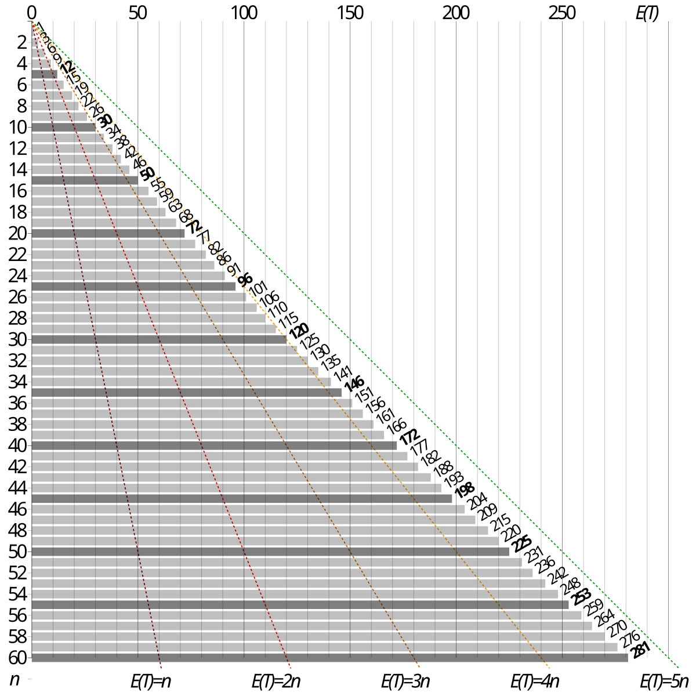
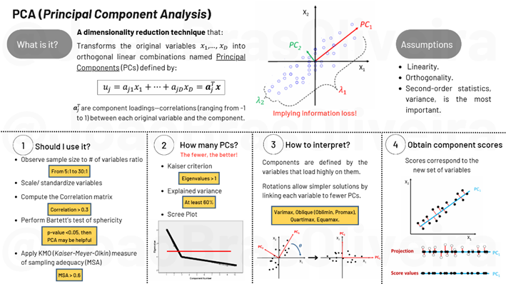

<!---
Overall GitHub Profile README
--->
# 👋 Hello there, I'm João Oliveira!   

## 🚀 **Aspiring Data Scientist | Machine Learning & Data Analytics Enthusiast**  

Welcome to my GitHub! 

Here is where I share a collection of my data science experiments, including code, analyses, and ideas.

I’m passionate about exploring **data science, machine learning, and analytics** to gain insights and solve real-world problems. This space is where I share my **projects, experiments, and learning materials**.  

---
## 🎯 What I'm Working On  
- Working on publishing my Master´s thesis on **Financial Statement Fraud (FSF) detection** in a peer-reviewed journal.
- Continuously improving my understanding of **Python**.   
- Building knowledge of **Containerization fundamentals**.  

---

## 📌 Projects
Each project has its own repository which you can access by clicking their images.
Feel free to **clone or fork** any of my projects.

| [   Image Credit: Own creation](https://github.com/JoaoBrasOliveira/decoding-the-numbers-and-language-behind-financial-statement-fraud) | [   Image Credit: <a href="https://unsplash.com/pt-br/@zoltantasi" target="_blank">Zoltan Tasi</a>](https://github.com/JoaoBrasOliveira/ethereum_prices) | [   Image Credit: <a href="https://unsplash.com/pt-br/@mahdibafande" target="_blank">Mahdi Bafande</a>](https://github.com/JoaoBrasOliveira/amazon_sentiment_analysis) |
|:---:|:---:|:---:|
| **Financial Statement Fraud Detection** | **Forecasting of Ethereum Prices** | **Sentiment Analysis of Amazon Reviews** |

| [   Image Credit: <a href="https://pt.wikipedia.org/wiki/Wikip%C3%A9dia:P%C3%A1gina_principal">Wikipedia</a>](https://github.com/JoaoBrasOliveira/pokemontcgp_greed) | [   Image Credit: <a href="https://www.chess.com/home">Chess.com</a>](https://github.com/JoaoBrasOliveira/chessbot) | [   Image Credit: Own creation](https://github.com/JoaoBrasOliveira/simple-machine-learning-explained) |
|:---:|:---:|:---:|
| **Pokémon TCGP Simulations** | **Creating an efficient Chess Bot** | **Simple ML Slides** |

